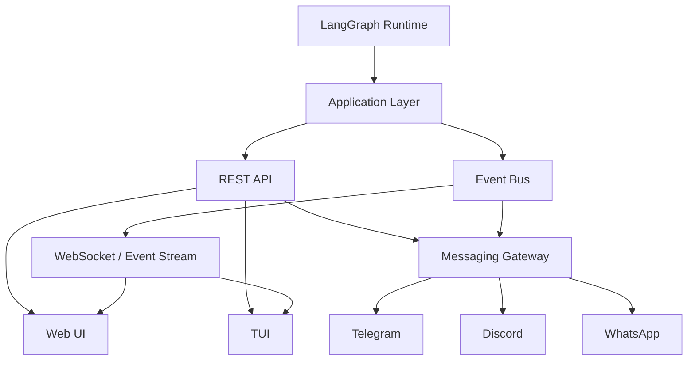

# AgentGraph OS — Remote Interface Foundation

**Status:** Required architecture task  
**Target:** Phase 3 foundation + future Web/TUI/Messaging phases  
**Priority:** High  
**Project:** AgentGraph OS

---

# 1. Purpose

AgentGraph OS must support multiple user interfaces without coupling the runtime, LangGraph, providers, or agents to any particular frontend technology.

The system must eventually be usable through:

- Web browser;
- mobile browser;
- PWA;
- local terminal TUI;
- Telegram;
- other messaging platforms;
- future native desktop/mobile clients;
- API clients.

All interfaces MUST operate through a common AgentGraph OS application/API layer.

The core runtime MUST NOT contain Telegram-specific, Web-specific, TUI-specific, React-specific, Discord-specific, WhatsApp-specific, or other presentation-layer logic.

The target architecture is:

```text
                         ┌────────────────────┐
                         │   AgentGraph OS    │
                         │       Core         │
                         └─────────┬──────────┘
                                   │
                          Runtime / LangGraph
                                   │
                         Domain/Application API
                                   │
              ┌────────────────────┼────────────────────┐
              │                    │                    │
              ▼                    ▼                    ▼
          REST / WS             Event Bus          Command Bus
              │                    │                    │
              └────────────────────┼────────────────────┘
                                   │
              ┌────────────────────┼────────────────────┐
              │                    │                    │
              ▼                    ▼                    ▼
           Web UI                TUI          Messaging Gateway
                                                        │
                                              ┌─────────┼─────────┐
                                              │         │         │
                                           Telegram  Discord  WhatsApp
```

This architecture is mandatory.

---

# 2. Important Phase 3 Boundary

The current project is executing Phase 3.

Do NOT interrupt or replace existing Phase 3 goals.

The current required Phase 3 work remains:

- OpenCode bridge through the actual local Server API;
- OpenAI-compatible adapter;
- LangGraph runtime router integration;
- metadata migration;
- provider visibility API;
- mocked provider tests;
- live smoke tests.

This task extends Phase 3 only with the minimum infrastructure needed to support future interfaces.

Phase 3 MUST implement:

1. normalized runtime events;
2. normalized runtime commands;
3. interface-independent application services;
4. API boundaries where required;
5. event subscription hooks;
6. authorization model foundation;
7. stable identifiers for projects/runs/tasks/agents/providers;
8. tests for these contracts.

Phase 3 MUST NOT attempt to implement the complete production Web UI, TUI, Telegram bot, Discord integration, WhatsApp integration, or native mobile application unless they already exist and require compatibility changes.

---

# 3. Architectural Principle

The following rule is mandatory:

> Interfaces are clients of AgentGraph OS. They are not part of the runtime.

The runtime MUST be able to operate with:

```text
Web UI = disabled
TUI = disabled
Telegram = disabled
Discord = disabled
WhatsApp = disabled
```

without loss of core functionality.

Likewise, adding or removing an interface MUST NOT require changes to:

- LangGraph nodes;
- LangGraph graph definitions;
- provider adapters;
- model routing logic;
- OpenCode bridge;
- agent business logic.

---

# 4. Required Layer Separation

Use a layered design equivalent to:

```text
domain/
application/
runtime/
providers/
api/
interfaces/
infrastructure/
```

Exact existing repository conventions take precedence over these names.

Do NOT reorganize the repository solely to match this example.

Responsibilities:

## Domain

Contains stable internal concepts.

Examples:

```text
Project
Run
Task
Agent
Provider
Approval
RuntimeEvent
RuntimeCommand
```

Domain models MUST NOT import frontend/messenger libraries.

---

## Application

Contains operations exposed to clients.

Examples:

```text
StartRun
StopRun
PauseRun
ResumeRun
RetryRun
GetRunStatus
ListRuns
GetLogs
ListProviders
SubmitApproval
RejectApproval
```

Application services are the canonical entry point for Web/TUI/Messaging clients.

---

## Runtime

Contains LangGraph execution and orchestration.

Runtime emits normalized events.

Runtime consumes normalized commands through application services.

Runtime MUST NOT send Telegram messages directly.

Runtime MUST NOT call WebSocket clients directly.

---

## API

Provides external transport.

Initial transport:

- REST;
- WebSocket/SSE where appropriate.

API handlers MUST remain thin.

Correct:

```text
HTTP request
    ↓
validation
    ↓
application service
    ↓
domain/runtime
```

Incorrect:

```text
HTTP request
    ↓
direct LangGraph manipulation
```

---

## Interfaces

Future clients/adapters:

```text
interfaces/
├── web/
├── tui/
└── messaging/
```

These consume the same application API/contracts.

---

# 5. Stable Runtime Identifiers

Every remotely observable entity MUST have a stable identifier.

At minimum:

```text
project_id
run_id
task_id
agent_id
provider_id
event_id
approval_id
```

IDs must not depend on UI state.

Do NOT use array indices or process-local positions as external IDs.

Identifiers must survive serialization.

---

# 6. Runtime Event Contract

Introduce a normalized event model.

Recommended conceptual structure:

```python
RuntimeEvent(
    id=...,
    type=...,
    timestamp=...,
    project_id=...,
    run_id=...,
    task_id=...,
    agent_id=...,
    provider_id=...,
    severity=...,
    payload=...,
    metadata=...,
)
```

Adapt naming to the existing code style.

Do NOT blindly duplicate an existing event model.

If an existing event/event-bus abstraction exists, extend it instead.

---

# 7. Required Event Types

The event model must support at least the following concepts:

```text
PROJECT_CREATED

RUN_CREATED
RUN_STARTED
RUN_PAUSED
RUN_RESUMED
RUN_COMPLETED
RUN_FAILED
RUN_CANCELLED

TASK_CREATED
TASK_STARTED
TASK_PROGRESS
TASK_COMPLETED
TASK_FAILED

AGENT_STARTED
AGENT_WAITING
AGENT_COMPLETED
AGENT_FAILED

PROVIDER_SELECTED
PROVIDER_CHANGED
PROVIDER_ERROR

TOOL_STARTED
TOOL_COMPLETED
TOOL_FAILED

APPROVAL_REQUIRED
APPROVAL_APPROVED
APPROVAL_REJECTED
APPROVAL_EXPIRED

LOG_CREATED
```

Exact enum naming may follow existing conventions.

Do not introduce unused event variants only to satisfy this list if equivalent events already exist.

Document mappings where existing event names differ.

---

# 8. Event Serialization

Every externally visible event MUST be serializable to JSON.

Example:

```json
{
  "event_id": "evt_...",
  "type": "task.progress",
  "timestamp": "2026-08-11T18:30:00Z",
  "project_id": "project_...",
  "run_id": "run_...",
  "task_id": "task_...",
  "agent_id": "agent_...",
  "provider_id": "provider_...",
  "payload": {
    "progress": 72,
    "message": "Implementing provider adapter"
  }
}
```

Do not expose:

- raw Python objects;
- arbitrary exception objects;
- secrets;
- provider credentials;
- environment variables;
- access tokens.

---

# 9. Event Bus

Provide a transport-neutral event publishing mechanism.

Concept:

```text
Runtime
   │
   └── publish(RuntimeEvent)
             │
             ├── persistence/logging
             ├── WebSocket subscribers
             ├── future Telegram subscriber
             └── future observability system
```

The runtime must publish once.

Consumers decide how events are presented.

Do NOT implement:

```python
if telegram_enabled:
    telegram.send(...)
```

inside runtime code.

---

# 10. Runtime Commands

Introduce normalized commands for remote control.

Minimum conceptual commands:

```text
START_RUN
PAUSE_RUN
RESUME_RUN
STOP_RUN
RETRY_RUN
SUBMIT_APPROVAL
REJECT_APPROVAL
```

Read-only operations:

```text
GET_STATUS
GET_RUN
LIST_RUNS
GET_LOGS
LIST_PROVIDERS
LIST_AGENTS
LIST_PROJECTS
```

All clients must eventually use the same application operations.

---

# 11. Command Safety

Commands must be categorized.

Recommended permission classes:

```text
READ
EXECUTE
CONTROL
APPROVE
ADMIN
```

Example:

```text
GET_STATUS       -> READ
GET_LOGS         -> READ

START_RUN        -> EXECUTE

PAUSE_RUN        -> CONTROL
RESUME_RUN       -> CONTROL
STOP_RUN         -> CONTROL

SUBMIT_APPROVAL  -> APPROVE

provider config  -> ADMIN
```

Do not hard-code Telegram IDs or browser users into runtime logic.

---

# 12. Approval System Foundation

AgentGraph OS must support remote approval requests.

Conceptual model:

```text
ApprovalRequest
├── approval_id
├── project_id
├── run_id
├── task_id
├── requested_by
├── action
├── description
├── risk
├── created_at
├── expires_at
├── status
└── metadata
```

Status:

```text
PENDING
APPROVED
REJECTED
EXPIRED
CANCELLED
```

The runtime must be capable of entering a waiting state when an approval is required.

Flow:

```text
Agent
  ↓
Approval required
  ↓
APPROVAL_REQUIRED event
  ↓
Run/Task waits
  ↓
User approves through any client
  ↓
application service
  ↓
APPROVAL_APPROVED
  ↓
execution continues
```

Telegram must NOT implement its own approval semantics.

Web UI must NOT implement its own approval semantics.

Approval belongs to the application/domain layer.

---

# 13. Web API Foundation

The existing FastAPI backend should remain the primary external application transport unless current project architecture explicitly dictates otherwise.

Do NOT introduce a second backend framework.

Expose or prepare canonical API groups equivalent to:

```text
/api/v1/health
/api/v1/system

/api/v1/projects
/api/v1/projects/{project_id}

/api/v1/runs
/api/v1/runs/{run_id}

/api/v1/runs/{run_id}/pause
/api/v1/runs/{run_id}/resume
/api/v1/runs/{run_id}/stop
/api/v1/runs/{run_id}/retry

/api/v1/agents

/api/v1/providers

/api/v1/approvals
/api/v1/approvals/{approval_id}/approve
/api/v1/approvals/{approval_id}/reject

/api/v1/events
```

The exact endpoints must conform to existing repository conventions.

Do not create duplicate endpoints if equivalent APIs already exist.

---

# 14. Real-Time Transport

Prepare real-time event delivery for browser/TUI clients.

Preferred:

```text
WebSocket
```

SSE is acceptable for server → client streams when technically preferable.

Recommended conceptual route:

```text
/ws/events
```

or:

```text
/api/v1/events/stream
```

Clients should be capable of subscribing by:

```text
project_id
run_id
event_type
```

if practical.

Do not block Phase 3 completion on advanced filtering if the foundational stream works.

---

# 15. Web UI Target Architecture

The future Web UI will be the primary rich remote interface.

It must eventually support:

```text
Dashboard
Projects
Runs
Agents
Providers
Models
Approvals
Logs
Files
Diffs
Settings
```

The Web UI is explicitly NOT required to be fully implemented in this Phase 3 task.

However, backend contracts introduced now must not prevent these capabilities.

Target interaction:

```text
Browser
   ↓
REST API
   ↓
Application layer
   ↓
AgentGraph OS

Browser
   ↑
WebSocket events
   ↑
Event Bus
```

---

# 16. Responsive Web Requirement

Future Web UI must support:

```text
Desktop
Laptop
Tablet
Phone
```

Do not design APIs that require desktop-only interaction patterns.

No backend endpoint may depend on:

- keyboard shortcuts;
- mouse state;
- terminal session;
- local filesystem path selected by a browser.

---

# 17. PWA Compatibility

The future Web UI should be capable of becoming a Progressive Web App.

Phase 3 does NOT need complete PWA implementation.

However, avoid architectural choices preventing:

- installable browser app;
- responsive mobile UI;
- reconnectable WebSocket session;
- notification support;
- deep links into a run/approval;
- authentication persistence.

---

# 18. TUI Target Architecture

The future TUI is a thin client.

Target:

```text
TUI
 ↓
AgentGraph OS API
 ↓
Application layer
 ↓
Runtime
```

The TUI MUST NOT duplicate orchestration logic.

The TUI MUST NOT instantiate a separate LangGraph runtime if the server runtime already exists.

Potential future command:

```bash
agentgraph
```

Possible views:

```text
Dashboard
Projects
Runs
Logs
Agents
Providers
Approvals
```

---

# 19. Messaging Gateway Target Architecture

The future Messaging Gateway must use provider adapters.

Concept:

```text
MessagingGateway
        │
        ├── TelegramProvider
        ├── DiscordProvider
        ├── WhatsAppProvider
        ├── SlackProvider
        └── FutureProvider
```

The initial implementation target should be Telegram.

Do not bind the generic messaging layer to Telegram terminology.

Wrong:

```python
telegram_chat_id
telegram_message
```

inside generic messaging models.

Correct:

```python
channel_id
recipient_id
message
provider
```

Provider-specific fields stay inside provider adapters/configuration.

---

# 20. Messaging Provider Interface

Future provider interface should conceptually expose operations equivalent to:

```python
class MessagingProvider:
    async def send_message(...):
        ...

    async def send_event(...):
        ...

    async def send_approval(...):
        ...

    async def handle_command(...):
        ...
```

Do not implement this exact class if repository abstractions make a different design more appropriate.

Preserve interface segregation.

---

# 21. Telegram Target Capabilities

Future Telegram integration should eventually support:

```text
/status
/projects
/runs
/agents
/providers
/logs
```

Control:

```text
/pause
/resume
/stop
/retry
```

Approvals:

```text
Approve
Reject
Details
```

Notifications:

```text
run started
run completed
run failed
task failed
provider failed
approval required
```

Telegram implementation is NOT mandatory during the Phase 3 foundation unless explicitly required by another project task.

---

# 22. WhatsApp / Discord / Slack

Do not implement these providers during Phase 3.

Only ensure that the Messaging Gateway design permits them later.

No core architecture may assume Telegram is the only provider.

---

# 23. Authentication Foundation

Remote interfaces introduce a security boundary.

Prepare an authentication/authorization abstraction.

Do not trust:

- Telegram bot token alone;
- chat ID alone;
- browser presence;
- local network location alone.

Future identities may look conceptually like:

```text
web:user:123
telegram:12345678
discord:12345678
api:key-id
```

All identities should map to internal authorization policies.

---

# 24. Authorization

Prepare permission checks at the application boundary.

Never rely only on UI hiding controls.

Example:

```text
User cannot STOP run
```

must be enforced server-side.

The Web UI disabling the button is insufficient.

Likewise Telegram command handlers must call the same authorization checks.

---

# 25. Secrets

The following MUST NOT be stored in source control:

```text
TELEGRAM_BOT_TOKEN
WHATSAPP credentials
Discord tokens
OpenAI keys
OpenRouter keys
API credentials
session secrets
JWT signing secrets
```

Use existing secrets/configuration mechanisms.

Example:

```text
.env
environment variables
secret store
```

Maintain/update `.env.example` with placeholders only.

---

# 26. Remote Exposure Safety

AgentGraph OS may later be reachable outside the home network.

Never expose an unauthenticated administrative API by default.

Default behavior should prefer:

```text
127.0.0.1
```

or existing safe bind settings.

Remote exposure must be explicit.

Do not automatically bind to:

```text
0.0.0.0
```

without intentional project configuration.

---

# 27. Logging

Remote clients require structured logs.

Where possible, log records should carry:

```text
project_id
run_id
task_id
agent_id
provider_id
timestamp
level
message
```

Never write secrets into logs.

---

# 28. Error Model

Provide a transport-safe error representation.

Concept:

```json
{
  "error": {
    "code": "RUN_NOT_FOUND",
    "message": "Run was not found",
    "details": {}
  }
}
```

Do not expose raw internal stack traces to remote clients in production mode.

Development logs may retain tracebacks through existing logging infrastructure.

---

# 29. Provider Visibility

Because Phase 3 already includes provider visibility API work, provider information exposed to clients should include safe metadata such as:

```text
provider_id
provider_type
display_name
enabled
available
health/status
capabilities
models
```

Never return:

```text
API key
access token
authorization header
raw credential config
```

---

# 30. Observability Contract

The system must make the following observable without inspecting internal process memory:

```text
current project
current run
run status
current task
current agent
selected provider
selected model when available
started_at
updated_at
completed_at
failure state
approval state
```

Do not fake progress percentages.

If exact progress cannot be calculated, expose state/message instead of inventing percentage completion.

Allowed:

```text
status = running
current_step = provider_adapter_tests
```

Not allowed:

```text
progress = 72%
```

unless that number is actually derived from known measurable work.

---

# 31. Reconnect Behavior

Remote clients may disconnect.

Runtime execution MUST NOT depend on active browser/TUI/Telegram connection.

Example:

```text
Browser closes
     ↓
AgentGraph run continues
     ↓
events continue/persist as designed
     ↓
Browser reconnects
     ↓
current run state can be fetched again
```

UI connection lifetime must never define runtime lifetime.

---

# 32. State Source of Truth

There MUST be one authoritative runtime/application state.

Never let:

```text
Web UI
Telegram
TUI
```

maintain independent canonical run state.

Clients may cache state, but the backend remains authoritative.

---

# 33. Idempotency / Duplicate Commands

Remote networks may resend requests.

Where relevant, protect destructive/important commands from accidental duplication.

Examples:

```text
STOP already stopped run
APPROVE already approved request
RETRY submitted twice
```

Operations should have deterministic behavior or clear conflict errors.

---

# 34. API Versioning

New public interfaces should use a versioned API boundary.

Recommended:

```text
/api/v1/
```

Do not unnecessarily version internal Python APIs.

The purpose is to allow future Web/TUI/mobile clients to evolve without uncontrolled breaking changes.

---

# 35. Configuration

Prepare configuration namespaces conceptually equivalent to:

```yaml
api:
  enabled: true

remote_control:
  enabled: false

messaging:
  enabled: false
```

Future:

```yaml
messaging:
  telegram:
    enabled: false

  discord:
    enabled: false

  whatsapp:
    enabled: false
```

Use the project's actual configuration format.

Do not introduce YAML if the project already standardizes on another mechanism.

---

# 36. Required Repository Investigation

Before editing code, OpenCode MUST inspect:

1. repository root;
2. AGENTS.md and nested AGENTS files;
3. current Phase 3 document;
4. architecture documentation;
5. FastAPI application;
6. LangGraph runtime;
7. provider interfaces;
8. current event models;
9. current command/service abstractions;
10. current authentication/config system;
11. tests.

Do not assume file paths.

Do not create duplicate abstractions until existing equivalents have been searched for.

---

# 37. Existing Architecture Takes Precedence

If the repository already has:

```text
event bus
command bus
service layer
DTO model
auth abstraction
WebSocket transport
run model
approval model
```

extend it.

Do NOT create parallel systems with different names.

Before creating a new abstraction, search the codebase.

---

# 38. AGENTS.md Rule

Add a mandatory rule to the appropriate AGENTS instructions.

Suggested wording:

```markdown
## Remote Interface Architecture

All user-facing interfaces — Web UI, TUI, Telegram, Discord,
WhatsApp, Slack, native clients, and future integrations — MUST
operate through shared AgentGraph OS application/API contracts.

No interface may directly own or duplicate LangGraph orchestration,
provider routing, run state, approval semantics, or authorization logic.

Runtime and provider code MUST remain independent from UI and
messaging SDKs.

Remote commands MUST pass through server-side authorization.

Runtime execution MUST remain independent of client connection lifetime.

Before introducing a new interface abstraction, search for and extend
existing event, command, service, API, authentication, and configuration
abstractions.
```

If the main `AGENTS.md` is intentionally small, create:

```text
docs/agent-rules/REMOTE_INTERFACES.md
```

and add a required reference from `AGENTS.md`.

Example:

```markdown
For Web/TUI/remote messaging/API architecture, read:
[Remote Interface Rules](docs/agent-rules/REMOTE_INTERFACES.md)
```

OpenCode MUST follow the project's existing documentation linking convention.

---

# 39. Architecture Documentation

Create or update documentation describing this layer.

Preferred existing-doc extension where possible.

If no suitable document exists, create:

```text
docs/architecture/REMOTE_INTERFACES.md
```

It must describe:

```text
Core
Application services
Event system
Command system
REST API
WebSocket/event stream
Web UI
TUI
Messaging Gateway
Authentication
Authorization
Approvals
Security boundary
```

Include a Mermaid diagram if Mermaid is already used by the project.

Recommended:



---

# 40. Roadmap Update

Update the project roadmap.

Do not renumber existing phases unnecessarily if doing so would invalidate project history.

Record future work equivalent to:

```text
Remote Interface / Observability
    ├── Web UI
    ├── responsive mobile UI
    ├── WebSocket real-time monitoring
    ├── approvals UI
    ├── logs
    └── PWA foundation

Messaging / Remote Control
    ├── Messaging Gateway
    ├── Telegram
    ├── notifications
    ├── remote commands
    ├── approvals
    └── future Discord/WhatsApp/Slack adapters

TUI
    ├── dashboard
    ├── runs
    ├── logs
    ├── providers
    └── approvals
```

If Phase numbers are already allocated, integrate these into existing phases rather than inventing conflicting numbering.

---

# 41. Phase 3 Implementation Scope

During the current Phase 3, implement only the foundation necessary for future interfaces.

Required now:

```text
[ ] Audit existing event/state/service architecture
[ ] Define stable external runtime identifiers
[ ] Define/extend normalized runtime event model
[ ] Define/extend event publishing abstraction
[ ] Make important runtime state queryable
[ ] Define/extend command/application service boundary
[ ] Ensure provider visibility returns safe metadata
[ ] Prepare authorization boundary
[ ] Prepare approval domain contract if absent
[ ] Expose or prepare versioned API contracts
[ ] Add real-time event transport if appropriate to current backend
[ ] Add serialization tests
[ ] Add authorization tests
[ ] Add event tests
[ ] Add API contract tests
[ ] Update architecture docs
[ ] Update roadmap
[ ] Update AGENTS rules
```

Not required now:

```text
[ ] Complete React/Vue/Svelte UI
[ ] Complete TUI
[ ] Telegram bot
[ ] Discord bot
[ ] WhatsApp integration
[ ] Slack integration
[ ] PWA service worker
[ ] native Android application
```

---

# 42. Suggested Internal File Layout

Only use this as guidance.

Do not force this structure if equivalent modules already exist.

```text
src/
├── domain/
│   ├── events.*
│   ├── commands.*
│   └── approvals.*
│
├── application/
│   ├── runs.*
│   ├── approvals.*
│   └── providers.*
│
├── api/
│   ├── routes/
│   │   ├── runs.*
│   │   ├── providers.*
│   │   ├── approvals.*
│   │   └── events.*
│   └── websocket.*
│
└── interfaces/
    ├── web/
    ├── tui/
    └── messaging/
        └── providers/
```

Do not create empty directories solely to mirror the diagram.

Create only files needed by the implementation.

---

# 43. Dependency Rule

Core packages MUST NOT import from interface packages.

Forbidden dependency direction:

```text
runtime -> web
runtime -> tui
runtime -> telegram
providers -> telegram
domain -> FastAPI
domain -> React
```

Allowed direction:

```text
web -> API/application
tui -> API/application
telegram -> Messaging Gateway -> application
API -> application
application -> domain/runtime abstractions
```

---

# 44. No Premature Framework Choice

Do not select or install a frontend framework during this foundation task unless:

1. the project already specifies one; or
2. current implementation explicitly requires it.

Do not add React/Vue/Svelte/Next/Vite merely because a Web UI is planned.

The purpose of this task is to make the backend interface-ready.

---

# 45. Dependency Discipline

Do not add a new dependency when the standard library or existing project dependencies already solve the requirement.

Any new runtime dependency must be justified in the implementation summary.

Avoid heavyweight messaging libraries during Phase 3 because messaging providers are not being implemented yet.

---

# 46. Backward Compatibility

Do not break existing provider APIs unless required for the Phase 3 architecture.

If contracts must change:

1. identify consumers;
2. update consumers;
3. update tests;
4. document migration;
5. preserve compatibility where reasonable.

---

# 47. Tests

Add tests appropriate to the repository.

At minimum test:

### Event model

```text
serialization
required identifiers
timestamp
payload
secret filtering where applicable
```

### Commands

```text
valid command
invalid target
duplicate command behavior
```

### Authorization

```text
READ user cannot execute CONTROL operation
CONTROL user can pause allowed run
unauthorized request denied server-side
```

### Approvals

```text
create pending request
approve pending request
reject pending request
cannot approve twice
cannot approve expired request
```

### API

```text
get run
list providers
provider secrets absent
invalid run returns stable error
```

### Real-time events

If event streaming is implemented:

```text
subscriber receives event
disconnected subscriber does not stop runtime
reconnect can fetch authoritative run state
```

---

# 48. Mocked Tests First

Network integrations MUST NOT be required for the normal unit test suite.

Do not require:

```text
Telegram
Discord
WhatsApp
OpenAI
OpenRouter
external internet
```

to test the foundation.

Live integration tests belong to explicit smoke/integration suites.

---

# 49. Definition of Done

This task is complete only when all applicable items below are true:

```text
[ ] Existing architecture was audited before introducing abstractions
[ ] Runtime has no UI/messenger-specific dependency
[ ] Normalized runtime events exist
[ ] Events are JSON serializable
[ ] Runtime state is externally queryable
[ ] Stable IDs exist for observable entities
[ ] Remote commands enter through application/service layer
[ ] Authorization is enforced server-side
[ ] Provider visibility contains no secrets
[ ] Approval contract exists or is explicitly documented for next phase
[ ] API contracts are documented
[ ] Event stream architecture is documented
[ ] Web/TUI/Messaging use the same conceptual backend
[ ] Disconnecting a client cannot terminate a run
[ ] Tests pass
[ ] Existing Phase 3 tests still pass
[ ] AGENTS rules updated
[ ] architecture documentation updated
[ ] roadmap updated
[ ] no unnecessary frontend/messenger dependency added
```

---

# 50. Required Final Verification

Before reporting completion, run the repository's documented verification commands.

At minimum, where available:

```text
format/lint
type checking
unit tests
integration tests
Phase 3 provider tests
```

Do not claim a test passed unless it was actually executed successfully.

If a test cannot be executed, report:

```text
NOT RUN
```

and state the exact reason.

---

# 51. Required OpenCode Completion Report

At the end of the task, return a structured report:

```markdown
# Remote Interface Foundation — Completion Report

## Status
PASS / PARTIAL / BLOCKED

## Architecture audit
What existed before changes.

## Implemented
Exact functionality added.

## Reused abstractions
Existing components extended instead of duplicated.

## Files created
List.

## Files modified
List.

## API changes
List endpoints/contracts.

## Event model
Events introduced or mapped.

## Authorization
What is currently enforced.

## Approval foundation
What exists and what remains.

## Tests
Command:
Result:

## Phase 3 compatibility
Explain whether current Phase 3 functionality changed.

## Deferred intentionally
- Web UI
- TUI
- Telegram
- Discord
- WhatsApp
- PWA
etc.

## New dependencies
List and justification, or:
None.

## Risks / technical debt
List concrete items only.

## Recommended next task
One specific next implementation step.
```

---

# 52. Mandatory OpenCode Working Rules

While performing this task:

1. Read repository instructions before changing files.
2. Inspect current implementation before proposing replacements.
3. Do not rewrite working architecture without necessity.
4. Do not silently change public contracts.
5. Do not fabricate existing functionality.
6. Do not mark TODO functionality as implemented.
7. Do not fake progress values.
8. Do not expose secrets through API/events/logs.
9. Do not couple runtime to Web/TUI/messaging.
10. Do not implement three separate control systems.
11. Do not duplicate authorization in each client.
12. Do not duplicate approval logic in each client.
13. Do not require a connected UI for runtime execution.
14. Keep Phase 3 focused.
15. Prefer small, testable commits/changes.
16. Follow existing code style.
17. Update documentation when contracts change.
18. Add tests for externally visible behavior.
19. Run existing tests before declaring completion.
20. Explicitly report anything that remains incomplete.

---

# 53. Critical Architecture Invariant

The following invariant must remain true throughout the project:

```text
               ONE AgentGraph OS backend
                         │
                  ONE source of truth
                         │
                 ONE control contract
                         │
                 ONE event contract
                         │
          ┌──────────────┼──────────────┐
          │              │              │
        Web UI           TUI         Messaging
```

Do not evolve toward:

```text
Web runtime
TUI runtime
Telegram runtime
```

or separate independent orchestration implementations.

---

# 54. Future Target

When this foundation is complete, future development must be able to add:

```text
Web UI
```

without changing LangGraph orchestration;

then:

```text
Telegram
```

without changing LangGraph orchestration;

then:

```text
TUI
```

without changing LangGraph orchestration.

A successful architecture should make each new interface primarily an adapter/client implementation.

---

# 55. Start Instruction

Proceed autonomously.

First:

1. inspect current repository instructions and Phase 3 state;
2. identify existing abstractions relevant to this task;
3. produce a concise implementation plan based on actual repository state;
4. implement the minimum Phase 3 foundation;
5. update rules/docs/roadmap;
6. add tests;
7. run verification;
8. return the completion report.

Do not stop to ask questions when the answer can be determined from the repository.

If an architectural conflict exists, preserve current working behavior and document the conflict instead of making an unsafe speculative rewrite.