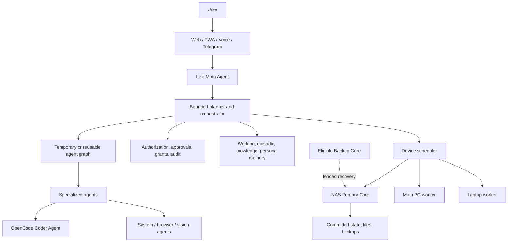

# AgentGraph OS Architecture Map

This map separates the **implemented current state** from the **approved target architecture**. A target document is not authorization to add its capability outside its roadmap phase.

## Current State: Phases 1-9

AgentGraph OS is a local-first modular monolith. A loopback FastAPI application is the lifecycle and authorization authority. It persists durable records in SQLite while process-local handles track live work. The browser is a client of versioned REST and normalized WebSocket contracts, never a runtime authority.

```mermaid
flowchart TD
  UI[React/Vite browser UI] --> API[FastAPI /api/v1]
  UI --> WS[WebSocket events]
  API --> Remote[RemoteCommandService]
  Remote --> Manager[AgentManager]
  Manager --> Runtime[LangGraph runtimes]
  Manager --> DB[(SQLite / Alembic)]
  Runtime --> Router[ModelRouter]
  Router --> Ollama[Ollama adapter]
  Router --> Bridge[OpenCode model bridge]
  Router --> Cloud[Optional OpenAI-compatible adapter]
  Runtime --> Memory[Scoped SQLite MemoryService]
  Runtime --> Tools[Controlled ToolService]
  Manager --> Events[RuntimeEventBus]
    Events --> WS
    Team[team-v1 static DAG] --> Manager
    Core[Core node registry] --> DB
    Worker[Outbound Worker] --> InternalWS[/ws/internal/workers]
    InternalWS --> Core
```

Implemented boundaries:

- `AgentManager` owns durable agent/run lifecycle, cancellation, and child-run delegation. Static `team-v1` DAGs are bounded and validated.
- `ModelRouter` normalizes local and optional provider calls. The OpenCode bridge is only a local LLM transport; OpenCode retains its authentication.
- Lexi is a normal Phase 6 agent/workflow with scoped lexical SQLite memory and registered, typed, approval-gated tools. There is no arbitrary shell.
- Vision is local observation through the model boundary with validated asset and folder controls.
- Remote control is disabled by default. Current authorization uses local configuration and current approvals are process-local, not durable.
- Restart recovery truthfully fails active runs. It does not checkpoint or resume work.
- Phase 9 Core persists Worker registry state. Workers reconnect using a stable
  opaque ID and an HMAC enrollment proof, report bounded safe capabilities, and
  can execute only typed `system.probe`. There is one Core; no scheduler,
  failover, distributed recovery, or arbitrary remote execution exists.

Detailed current contracts: [`architecture/REMOTE_INTERFACES.md`](architecture/REMOTE_INTERFACES.md), [`architecture/LEXI.md`](architecture/LEXI.md), [`architecture/MULTI_AGENT_ORCHESTRATION.md`](architecture/MULTI_AGENT_ORCHESTRATION.md), [`architecture/VISION.md`](architecture/VISION.md), [`MEMORY.md`](MEMORY.md), [`MODEL_ROUTER.md`](MODEL_ROUTER.md), and [`TOOLS.md`](TOOLS.md).

## Target Map: Post-Phase-7

The following is an approved architectural direction, not an implemented system.



Target principles are defined by [`FUTURE_VISION.md`](FUTURE_VISION.md) and the dependency order by [`ROADMAP.md`](ROADMAP.md). Functional correctness, reliability, security, and user control precede visual polish.

## Target Architecture Index

| Area | Canonical record |
|---|---|
| Lexi, planning, goals, graphs, and proactive behavior | [`architecture/LEXI.md`](architecture/LEXI.md) |
| Distributed Core, workers, failover, and scheduling | [`architecture/DISTRIBUTED_RUNTIME.md`](architecture/DISTRIBUTED_RUNTIME.md) |
| Checkpoints, recovery, rollback, and run history | [`architecture/RESILIENCE_AND_RECOVERY.md`](architecture/RESILIENCE_AND_RECOVERY.md) |
| Remote/PWA/messaging, Remote View, notifications | [`architecture/REMOTE_INTERFACES.md`](architecture/REMOTE_INTERFACES.md) |
| Trust, approvals, grants, credentials, and lockdown | [`architecture/SECURITY_AND_TRUST.md`](architecture/SECURITY_AND_TRUST.md) |
| OpenCode Coder Agent | [`architecture/OPENCODE_INTEGRATION.md`](architecture/OPENCODE_INTEGRATION.md) |
| Memory types, entity graph, provenance, and memory UI | [`MEMORY.md`](MEMORY.md) |
| Model profiles, Local Only, cost, and limits | [`MODEL_ROUTER.md`](MODEL_ROUTER.md) |
| Voice | [`architecture/VOICE_INTERACTION.md`](architecture/VOICE_INTERACTION.md) |
| Unified files, semantic search, backup, and restore | [`architecture/STORAGE_SEARCH_BACKUP.md`](architecture/STORAGE_SEARCH_BACKUP.md) |
| Dashboard and structured UI context | [`architecture/VISUAL_INTERFACE.md`](architecture/VISUAL_INTERFACE.md) |
| Terminology and risks | [`GLOSSARY.md`](GLOSSARY.md), [`RISK_REGISTER.md`](RISK_REGISTER.md) |

## Dependency Direction

All current and target clients use shared AgentGraph OS application/API contracts. UI, messaging, voice, and Remote View must not own runtime lifecycle, provider routing, authorization, or approval semantics. Provider and device adapters stay behind project-owned contracts. Model output and retrieved memory remain data, not authority or executable instructions.

The target roadmap preserves: safety before autonomy; persistence and recovery before unattended work; identity before worldwide remote control; single-node correctness before distributed optimization; and observability before automatic remediation.
