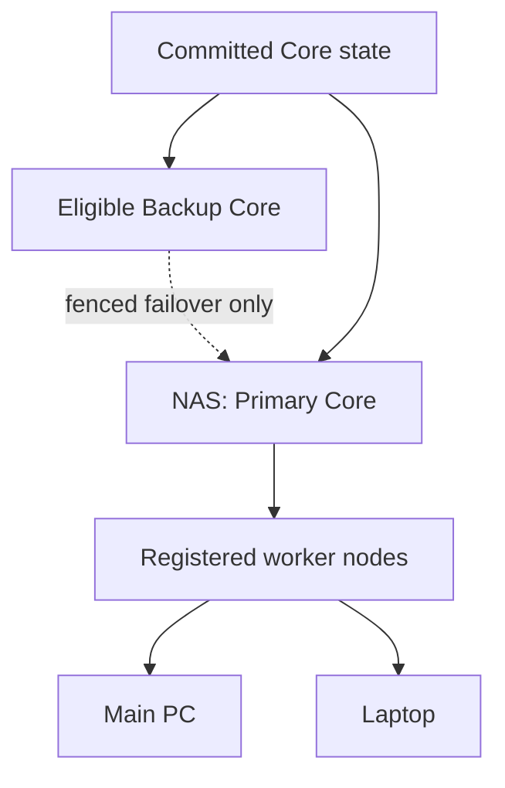

# Distributed Runtime Target

Status: approved target architecture. No distributed Core, worker protocol, or failover is implemented.

## Topology

The NAS is the intended 24/7 Primary Core. It owns authoritative policy, durable state, run history, scheduling decisions, and Core coordination. A main PC, laptop, or future node is a Worker Node unless explicitly configured as an eligible Backup Core. Workers advertise bounded capabilities and never become authorization authorities merely by connecting.

## Failover and Scheduling

Failover must detect missed heartbeats, choose a configured eligible Backup Core, fence the former Primary, restore only committed state, validate incomplete external effects, and notify the user. Promotion must avoid split-brain and duplicate execution; recovery uncertainty is an approval or blocker boundary, not permission to replay actions. The lease/quorum, storage replication, and fencing method require Phase 9 research and phase-specific design.

The future scheduler may assign graph nodes by declared capabilities, model availability, CPU, RAM, GPU, thermal state, free storage, network, energy, priority, and health. Assignment is observable and persisted with the Run. Single-node correctness remains required before multi-node optimization.

See [`RESILIENCE_AND_RECOVERY.md`](RESILIENCE_AND_RECOVERY.md), [`SECURITY_AND_TRUST.md`](SECURITY_AND_TRUST.md), and ADR-0006.
