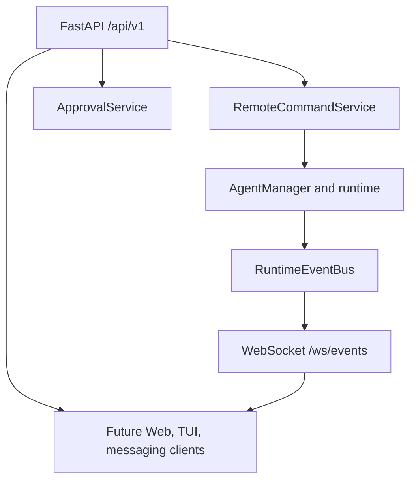

# Remote Interfaces: Current Foundation and Target Access

## Implemented boundary

AgentGraph OS has one local FastAPI application as the external control plane.
`AgentManager` remains the authoritative lifecycle service; the remote API calls
`RemoteCommandService` for supported run/provider/agent operations. The runtime
publishes normalized `RuntimeEvent` instances to the transport-neutral,
process-local `RuntimeEventBus`.

## Contracts

- Stable IDs: durable agent/run UUIDs plus `project_id`, `task_id`, generated
  `evt_*` event IDs, and generated `apr_*` approval IDs.
- Events include lifecycle, task, agent, provider, tool, approval, and log
  concepts. They serialize through `event_json`; secret-like payload keys are
  redacted before history or subscribers receive them.
- Supported remote commands currently cover starting, stopping, and reading
  runs; listing agents and providers. Additional command enum values describe
  future operations and are not exposed as working controls.
- Versioned HTTP endpoints: `/api/v1/health`, `/api/v1/system`,
  `/api/v1/projects`, `/api/v1/agents`, `/api/v1/runs/{run_id}`,
  `/api/v1/agents/{agent_id}/runs`, `/api/v1/runs/{run_id}/stop`,
  `/api/v1/providers`, `/api/v1/approvals`, `/api/v1/events`, and Phase 9
  `/api/v1/nodes` read/control/probe endpoints.
- `/ws/internal/workers` is a separate Core-only internal protocol, not a
  browser/client WebSocket. Workers authenticate with a derived enrollment
  proof and do not gain client or runtime authority.
- `GET /api/v1/events` is reconnect history and `GET /ws/events` is the live
  stream. A subscriber queue is bounded; a slow or disconnected subscriber is
  discarded without affecting a run.
- Remote failures use `{ "error": { "code", "message", "details" } }` and do
  not expose internal traces.

## Authorization and approval

`AGENTGRAPH_REMOTE_CONTROL_ENABLED` is `false` by default. When enabled,
`AGENTGRAPH_REMOTE_CONTROL_POLICIES` maps an internal identity string to
`read`, `execute`, `control`, `approve`, or `admin` permissions. The current
transport receives the identity from the `X-AgentGraph-Identity` header; this is
an authorization foundation, not a complete credential issuer. Browser WebSocket
clients carry that non-secret development identity in the negotiated
`agentgraph.identity.<base64url>` subprotocol because native browser WebSockets
cannot set arbitrary headers. It is not a credential and must never carry a
token, secret, or password.

The pre-versioned `/api/*` compatibility router is disabled by default through
`AGENTGRAPH_LEGACY_API_ENABLED=false`; it exists only for isolated legacy tests
or explicitly configured local migration work. Browser clients use `/api/v1`.

`ApprovalService` keeps process-local pending approvals, publishes required,
approved, rejected, and expired events, and rejects duplicate decisions. It is
not yet durable and does not pause/resume runtime execution; that requires an
explicit persisted runtime-waiting design.

## Intentional deferrals

No Web UI, TUI, PWA, Telegram, Discord, WhatsApp, Slack, messaging SDK, remote
credential issuer, durable approval store, or runtime pause/resume/retry control
is implemented by this foundation.

## Approved Target: Remote Access

The future access surfaces are responsive web, installable PWA, Web Push,
Telegram fallback/control, voice, and desktop browser. A native Android client
is not a required product path. All remain clients of shared server contracts;
connection state never determines Run lifetime.

Low-bandwidth mode prioritizes text chat, voice commands, status, approvals, and
compact notifications. Heavy visual streams are optional. Notification severities
are `INFO`, `SUCCESS`, `WARNING`, `ACTION_REQUIRED`, and `CRITICAL`; users may
later route severity to supported channels.

Remote View is a planned, separately authorized read-oriented view of registered
devices, applications, terminal, or files. It does not imply desktop automation
or privileged control. Future structured UI context may identify the selected
project/device/entity so Lexi does not have to infer it from a screenshot.

Worldwide access requires the planned identity, trusted-device, grant,
revocation, audit, and lockdown controls in
[`SECURITY_AND_TRUST.md`](SECURITY_AND_TRUST.md). See also
[`VOICE_INTERACTION.md`](VOICE_INTERACTION.md) and
[`VISUAL_INTERFACE.md`](VISUAL_INTERFACE.md).
