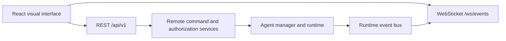

# Visual Interface

## Architecture

The Vite/React application in `frontend/` is a browser client of AgentGraph OS.
It communicates only through the versioned remote REST API and normalized event
WebSocket. The backend remains the source of truth for agents, graphs, runs,
provider metadata, approvals, permissions, and lifecycle state.

## Client layers

- `src/contracts.ts` validates REST and WebSocket payloads with Zod.
- `src/api.ts` centralizes JSON, the development identity header, timeout,
  network failures, and remote error envelopes.
- `src/events.ts` reconnects the live stream and only retains a bounded 500-event
  in-memory view at the app level.
- `src/pages.tsx` provides the dashboard, projects, agents, graph editor, run
  workspace, approvals, providers, events, and settings views.
- `src/i18n.tsx` provides an English/Russian client-only preference, while
  `/help` documents the workflow and safety boundary for every navigation area.

## Routing and deployment

Vite serves the frontend separately in development. Its proxy forwards `/api`
and `/ws` to the loopback backend. Relative endpoints work without frontend
configuration; `VITE_AGENTGRAPH_API_URL`, `VITE_AGENTGRAPH_WS_URL`, and
`VITE_AGENTGRAPH_IDENTITY` are optional non-secret development overrides.

Production builds use `pnpm build`. Serving the static build from the backend is
not implemented; deployment integration remains an explicit later decision.

## Security and permissions

The UI never accesses provider endpoints or secrets. API actions include the
existing non-secret development identity header. Native browser WebSockets use
the documented `agentgraph.identity.<base64url>` subprotocol bridge because they
cannot set arbitrary headers. This is not authentication or a credential issuer.

Controls may be unavailable when the server denies them, but the backend is the
only authorization authority. Remote-disabled and network error responses render
as clear UI states instead of client-side workarounds.

## PWA foundation

The application has responsive viewport and theme metadata. A manifest, offline
cache, and service worker are intentionally deferred to avoid caching dynamic
agent state or stale control responses.

## Known boundaries

Approvals remain process-local and do not pause/resume a run. The UI makes this
limitation explicit. There is no login, OAuth, SSO, messaging integration, or
browser-owned lifecycle implementation.

## Approved Target: Dashboard and Context

The future dashboard prioritizes system state and Lexi before visual polish. It
may support user-customizable widgets, layouts, resize/hide/show behavior, and
multiple dashboards such as Home, Development, NAS, and Monitoring. Candidate
widgets include goals, tasks, agents, active graphs, queue, approvals, devices,
resource/temperature state, applications, updates, models, events, GitHub,
calendar, Telegram, and notifications.

Structured UI context may carry the selected project, device, application, or
entity to the backend so Lexi can answer contextual questions without relying on
screenshots. It remains user-interface context, not an authorization grant or
backend state override. This dashboard capability is planned, not implemented.
